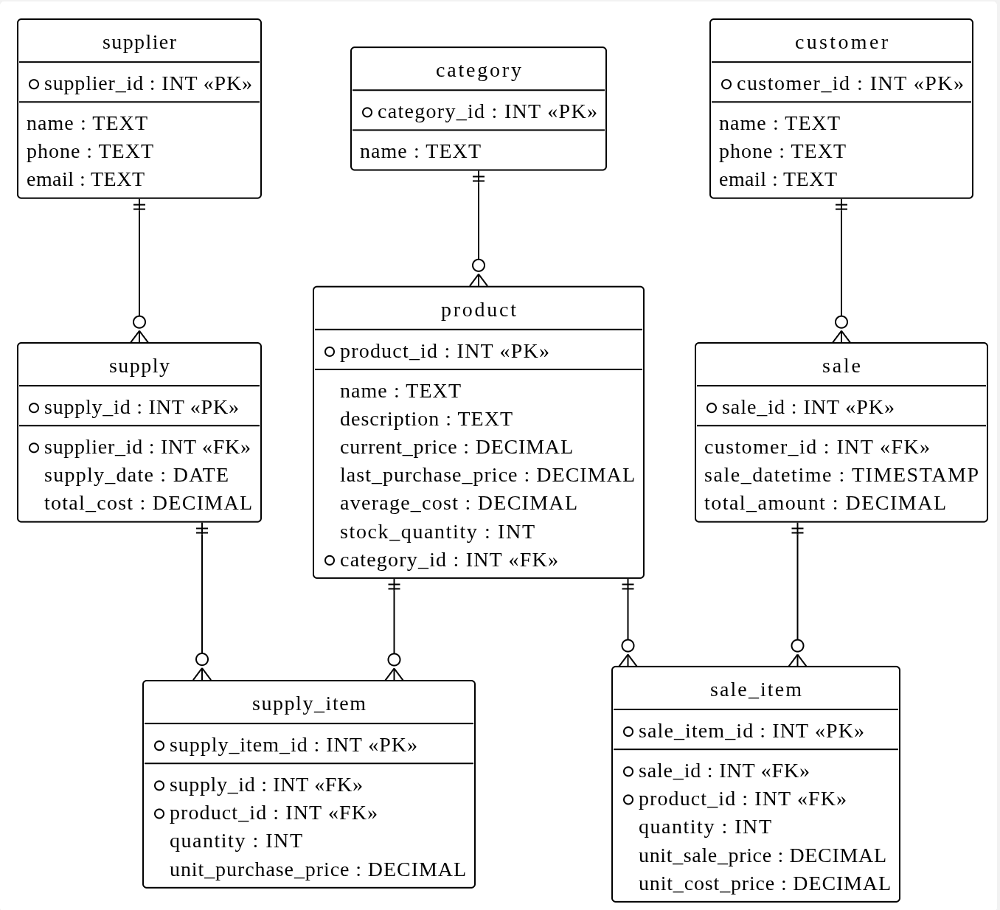
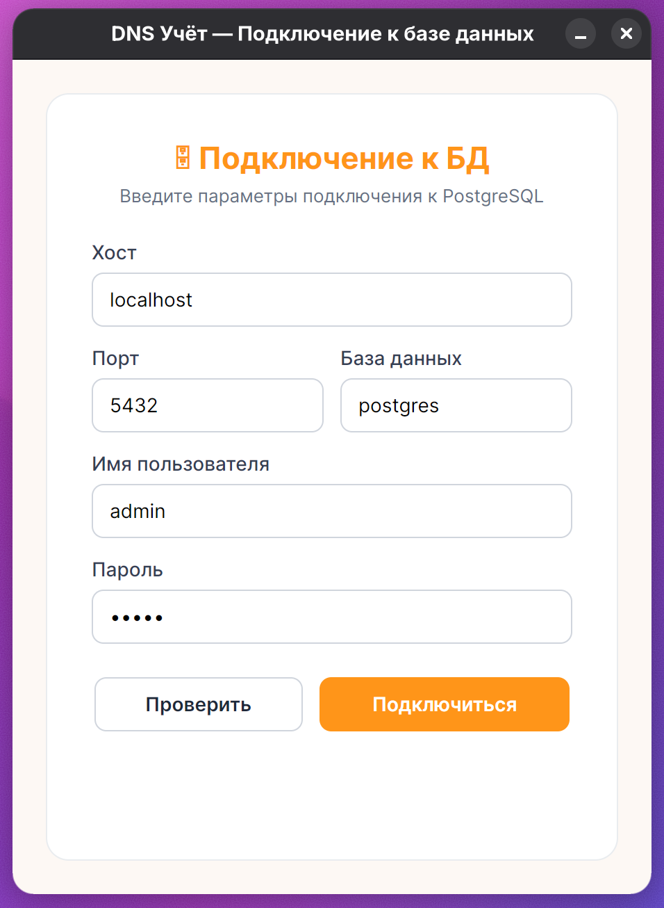
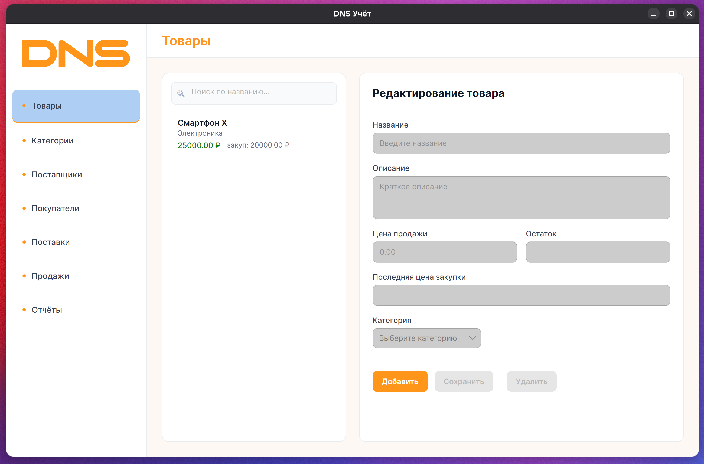
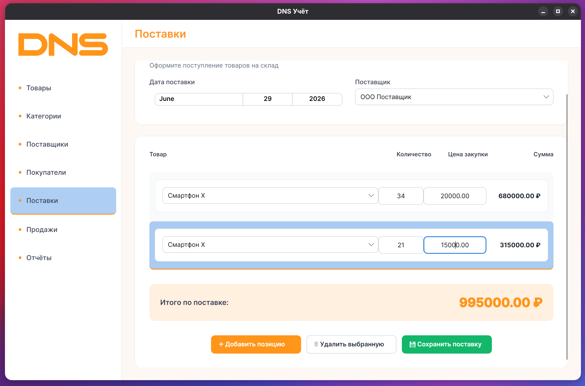
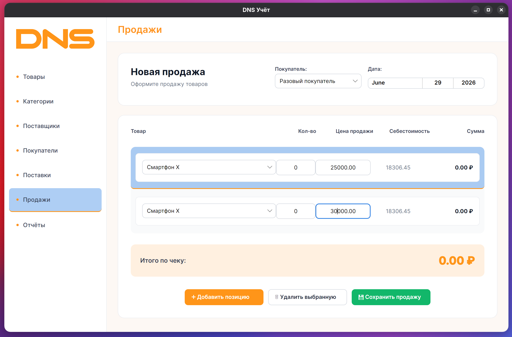
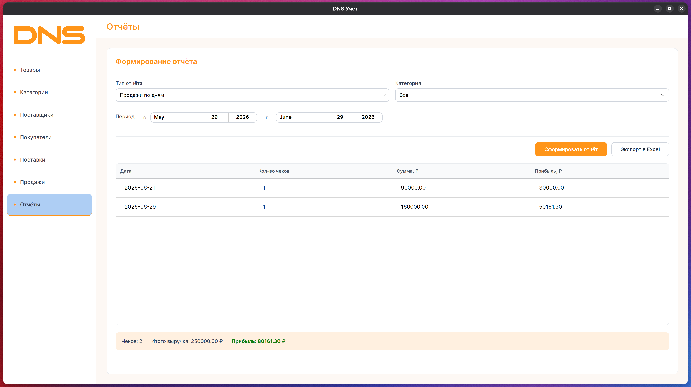
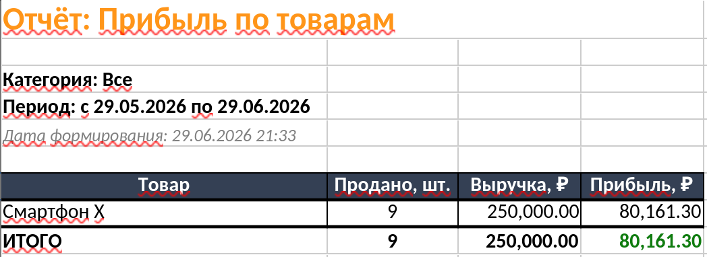

# DNS — Учёт поставок и продаж

**MVP-приложение** для учёта товаров, поставок, продаж и формирования отчётов.  
Разработано на **Avalonia UI** с использованием **PostgreSQL** в качестве СУБД.

---

## 🛠 Используемый стек

| Технология | Назначение |
|---|---|
| **Avalonia UI 12.0** | Кроссплатформенный UI-фреймворк |
| **.NET 10** | Платформа выполнения |
| **PostgreSQL + Npgsql** | СУБД и драйвер подключения |
| **CommunityToolkit.Mvvm** | MVVM-инфраструктура (ObservableObject, RelayCommand, Source Generators) |
| **ClosedXML** | Экспорт отчётов в Excel (.xlsx) |

---

## 🗄 Схема базы данных


---

## 📸 Краткие скриншоты интерфейса

### 1. Окно подключения к БД


### 2. Главное окно и навигация


### 3. Справочник «Поставщики»


### 4. Справочник «Покупатели»


### 5. Оформление отчета
- **Товары на складе** — текущие остатки и цены
- **Продажи по дням** — динамика выручки и прибыли
- **Прибыль по товарам** — ранжирование по маржинальности



### 6. Экспорт в Excel


## 🗂️ Структура проекта
---
```
dns
│  ├─ Desktop
│  │  ├─ App.axaml
│  │  ├─ App.axaml.cs
│  │  ├─ Assets
│  │  │  ├─ avalonia-logo.ico
│  │  │  └─ dns.png
│  │  ├─ Data
│  │  │  ├─ DatabaseService.cs
│  │  │  └─ Repositories
│  │  │     ├─ BaseRepository.cs
│  │  │     ├─ CategoryRepository.cs
│  │  │     ├─ CustomerRepository.cs
│  │  │     ├─ ProductRepository.cs
│  │  │     ├─ ReportRepository.cs
│  │  │     ├─ SaleRepository.cs
│  │  │     ├─ SupplierRepository.cs
│  │  │     └─ SupplyRepository.cs
│  │  ├─ Models
│  │  │  ├─ Category.cs
│  │  │  ├─ ConnectionSettings.cs
│  │  │  ├─ Customer.cs
│  │  │  ├─ Product.cs
│  │  │  ├─ Reports
│  │  │  │  ├─ ProfitByProductReportRow.cs
│  │  │  │  ├─ SalesByDayReportRow.cs
│  │  │  │  └─ StockReportRow.cs
│  │  │  ├─ Sale.cs
│  │  │  ├─ SaleItem.cs
│  │  │  ├─ Supplier.cs
│  │  │  ├─ Supply.cs
│  │  │  └─ SupplyItem.cs
│  │  ├─ Program.cs
│  │  ├─ Services
│  │  │  └─ SettingsService.cs
│  │  ├─ ViewLocator.cs
│  │  ├─ ViewModels
│  │  │  ├─ CategoriesViewModel.cs
│  │  │  ├─ ConnectionViewModel.cs
│  │  │  ├─ CustomersViewModel.cs
│  │  │  ├─ MainWindowViewModel.cs
│  │  │  ├─ ProductsViewModel.cs
│  │  │  ├─ ReportsViewModel.cs
│  │  │  ├─ SaleItemViewModel.cs
│  │  │  ├─ SalesViewModel.cs
│  │  │  ├─ SuppliersViewModel.cs
│  │  │  ├─ SuppliesViewModel.cs
│  │  │  ├─ SupplyItemViewModel.cs
│  │  │  └─ ViewModelBase.cs
│  │  ├─ Views
│  │  │  ├─ CategoriesView.axaml
│  │  │  ├─ CategoriesView.axaml.cs
│  │  │  ├─ ConnectionWindow.axaml
│  │  │  ├─ ConnectionWindow.axaml.cs
│  │  │  ├─ CustomersView.axaml
│  │  │  ├─ CustomersView.axaml.cs
│  │  │  ├─ MainWindow.axaml
│  │  │  ├─ MainWindow.axaml.cs
│  │  │  ├─ ProductsView.axaml
│  │  │  ├─ ProductsView.axaml.cs
│  │  │  ├─ ReportsView.axaml
│  │  │  ├─ ReportsView.axaml.cs
│  │  │  ├─ SalesView.axaml
│  │  │  ├─ SalesView.axaml.cs
│  │  │  ├─ SuppliersView.axaml
│  │  │  ├─ SuppliersView.axaml.cs
│  │  │  ├─ SuppliesView.axaml
│  │  │  └─ SuppliesView.axaml.cs

```
---

## 🚀 Запуск

```bash
dotnet run --project Desktop/Desktop
```

**Требования:**
- .NET 10 SDK
- Запущенный PostgreSQL-сервер (по умолчанию: `localhost:5432`, пользователь `admin`)